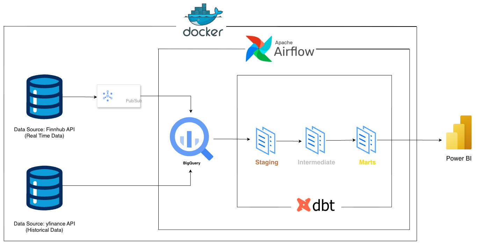
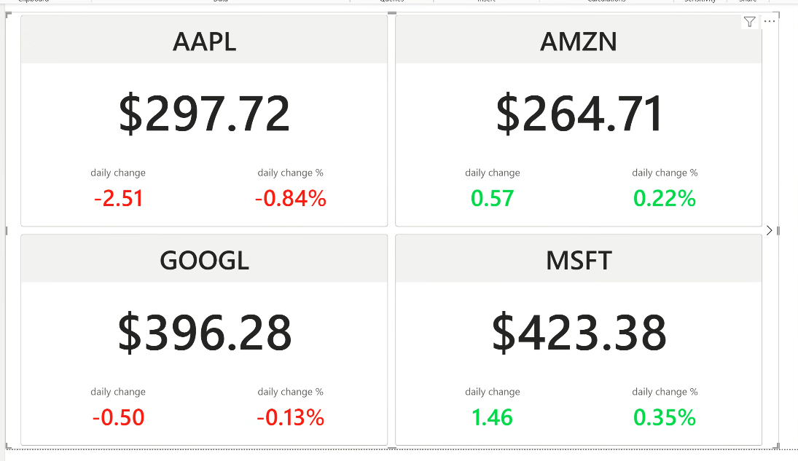
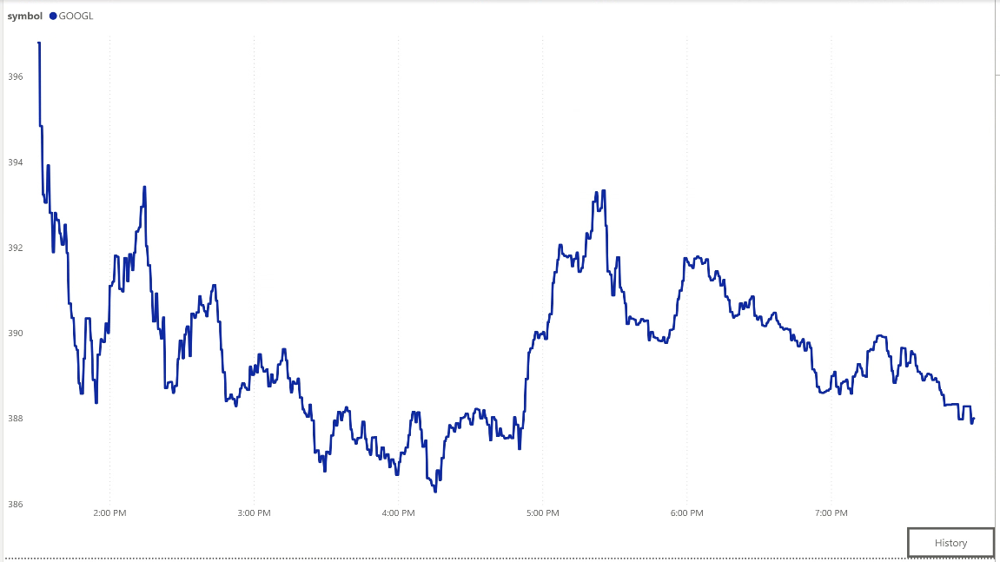
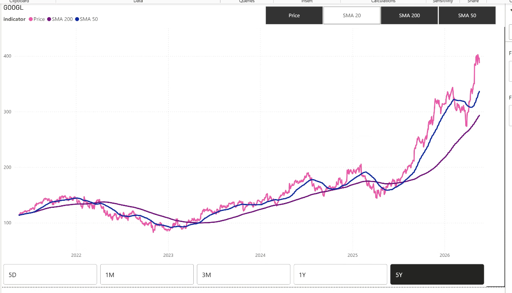

# 📈 Real-Time Stock Analytics Pipeline

      

A production-ready data engineering project demonstrating real-time streaming and batch processing with the Modern Data Stack — from live API ticks all the way to a Power BI dashboard.

---

## 📌 What This Project Does

This pipeline processes real-time and historical stock market data through a modern data architecture:

- **Real-time streaming:** Live stock quotes via Finnhub → GCP Pub/Sub → BigQuery
- **Historical batch load:** 5-year OHLC data via yfinance → BigQuery (one-time backfill)
- **Data transformation:** dbt layered architecture (Staging → Intermediate → Marts)
- **Technical indicators:** SMA, EMA, RSI, Bollinger Bands, ATR — all computed entirely in **dbt Jinja macros**
- **Analytics:** Power BI dashboards with real-time intraday and 5-year historical views

**Tracked symbols:** AAPL · TSLA · MSFT · GOOGL · AMZN · NVDA

---

## 🏗️ Architecture



---

## ⚡ Tech Stack

| Layer          | Technology                    | Purpose                               |
| -------------- | ----------------------------- | ------------------------------------- |
| Ingestion      | Python, Finnhub API, yfinance | Real-time ticks + historical backfill |
| Streaming      | GCP Pub/Sub                   | Message queue → BigQuery              |
| Warehouse      | Google BigQuery               | Cloud data warehouse                  |
| Transformation | dbt-core + dbt-bigquery       | SQL models, tests, documentation      |
| Orchestration  | Apache Airflow                | Workflow automation                   |
| Infrastructure | Docker + Docker Compose       | Containerised deployment              |
| Visualisation  | Power BI                      | Dashboards & analytics                |

---

## ✅ Key Features

- Live stock market data ingestion via **Finnhub API** (not simulated)
- Built-in **deduplication**, **market hours gate**, and **stagnation circuit breaker** in producer
- **5-year historical base** merged incrementally with live data — no full rebuilds
- **10+ dbt models** with data quality classification (`VALID` / `INCONSISTENT` / `INVALID`) on every tick
- Technical indicators computed **entirely in SQL** via custom dbt macros
- Automated **dbt tests** on every model — `not_null`, `unique`, `accepted_range`
- Two Airflow DAGs: **EOD** (4:30 PM ET daily) and **intraday** (every 5 min, market hours)
- Power BI dashboard with **real-time** and **5-year historical** views

---

## 🚀 Quick Start

### Prerequisites

- Docker & Docker Compose
- GCP project with BigQuery and Pub/Sub enabled
- Finnhub API key ([free tier](https://finnhub.io/))
- Python 3.10+

### Setup

**1. Clone and configure**

```bash
git clone https://github.com/rerebebe/financial-data-pipeline.git
cd financial-data-pipeline
cp .env.example .env
# Fill in: FINNHUB_API_KEY, GOOGLE_BIGQUERY_PROJECT_ID
```

**2. Add GCP service account key**

```bash
# Place your service account JSON at the project root:
./gcp-key.json
```

**3. Start Airflow**

```bash
cd orchestration
docker-compose up -d
# Airflow UI → http://localhost:8080
```

**4. Run the historical backfill (first time only)**

```bash
python backfill_stocks_prices.py
```

**5. Start the real-time producer**

```bash
python producer.py
```

**6. Trigger the EOD DAG manually (first run)**

Airflow UI → `eod_dag` → trigger manually to build all dbt models from scratch.

You're done. Data flows automatically after this. ✅

---

## ⚙️ Step-by-Step Implementation

### 1. Real-Time Ingestion — `producer.py`

- Polls Finnhub API for live quotes every second across 6 symbols
- **Deduplication** per symbol — skips ticks where price hasn't changed
- **Market hours gate** — auto-sleeps outside NYSE trading hours (9:30–16:00 ET)
- **Stagnation circuit breaker** — sleeps 1 hour after 10 consecutive unchanged prices
- Publishes JSON payloads to GCP Pub/Sub topic `stock-quotes-stream`

### 2. Historical Backfill — `backfill_stocks_prices.py`

- Fetches 5-year OHLCV history via yfinance for all 6 symbols
- Loads directly into BigQuery `raw_5_year_stock_price`
- Run once at setup — the incremental dbt merge takes over from there

### 3. Staging Layer — parsing & quality classification

- `stg_stock_quotes` — parses raw Pub/Sub JSON, deduplicates via `QUALIFY ROW_NUMBER()`, classifies each tick as `VALID`, `INCONSISTENT`, or `INVALID`
- `stg_5_year_stock_price` — type casts and standardises the historical raw table

### 4. Intermediate Layer — aggregation & incremental merge

- `int_finnhub_intraday_cleaned` — filters to `VALID` ticks, adds `data_source` tag
- `int_daily_summary_from_intraday` — aggregates intraday ticks into daily OHLC (open, high, low, close)
- `int_unified_stock_history` — incremental merge of 5-year base + daily summaries; lookback anchored to `max(quote_date) - 10 days` to handle missed runs safely

### 5. Marts Layer — indicators & serving

- `fct_stock_history_performance` — full history enriched with all technical indicators
- `fct_stock_intraday` — real-time price rendering on Power BI
- `fct_stock_snapshot` — one row per symbol, current price + all indicators

### 6. Airflow Orchestration

### Shared upstream (both DAGs depend on this):

`stg_stock_quotes` → `int_finnhub_intraday_cleaned`

### DAGs

| DAG                             | Schedule                   | Pipeline                                                                                                                           |
| ------------------------------- | -------------------------- | ---------------------------------------------------------------------------------------------------------------------------------- |
| `eod_dag`                       | 4:30 PM ET, Mon–Fri        | `int_finnhub_intraday_cleaned` → `int_daily_summary_from_intraday` → `int_unified_stock_history` → `fct_stock_history_performance` |
| `intraday_dag`                  | Every 5 min, 9:00–15:55 ET | int_finnhub_intraday_cleaned → fct_stock_intraday                                                                                  |
| ↘ fct_stock_snapshot (parallel) |

### 7. Power BI Dashboard

- Connected via BigQuery connector
- **Real-time Overview** — Tracking all the symbol with current price, daily change %
- **Real-time view** — live price, RSI, EMA signals, intraday OHLC per symbol
- **Historical view** — 5-year price chart, SMA crossovers, Bollinger Band channels

---

## 📊 Technical Indicators

All indicators are implemented as **custom dbt macros** in `macros/stock_indicators.sql` using BigQuery window functions — no Python, no external libraries.

| Indicator             | Method                                         |
| --------------------- | ---------------------------------------------- |
| SMA 20 / 50 / 200     | Rolling `AVG()` over window                    |
| EMA 9 / 20            | Wilder's smoothing via recursive approximation |
| RSI 14                | Wilder's smoothed average gain/loss ratio      |
| Bollinger Bands       | SMA 20 ± 2× rolling `STDDEV_POP()`             |
| ATR 14                | Wilder's smoothed true range                   |
| Annualised Volatility | Rolling `STDDEV_POP(daily_return)` × √252      |

---

## 📂 Data Models

### Staging

| Model                    | Description                                                       |
| ------------------------ | ----------------------------------------------------------------- |
| `stg_stock_quotes`       | Parses semi-structured JSON API payloads into a structured schema |
| `stg_5_year_stock_price` | Type-cast 5-year OHLCV historical data                            |

### Intermediate

| Model                             | Description                                                                                          |
| --------------------------------- | ---------------------------------------------------------------------------------------------------- |
| `int_finnhub_intraday_cleaned`    | Intraday stock ticks enriched with data quality status classification and original data source tags. |
| `int_daily_summary_from_intraday` | Incremental daily summary aggregator. Uses a 3-day lookback window for fast, incremental processing. |
| `int_unified_stock_history`       | Incrementally merged 5yr + live daily history                                                        |

### Marts

| Model                            | Description                                                                                                                                                          |
| -------------------------------- | -------------------------------------------------------------------------------------------------------------------------------------------------------------------- |
| `fct_stock_history_performance`  | Full historical timeline enriched with all calculated technical indicators (SMA, RSI, etc.).                                                                         |
| `fct_stock_indicators_unpivoted` | Transforms calculated technical metrics from a wide table format into a normalized long format (mapping columns into unified indicator and value rows) for Power BI. |
| `fct_stock_intraday`             | Real-time intraday view designed for streaming and immediate Power BI visibility.                                                                                    |
| `fct_stock_snapshot`             | Overview KPI Cards (Latest Price, Daily Change) on Power BI, one row per symbol                                                                                      |
| `dim_date`                       | Full date spine (2020–2030) for Power BI slicing                                                                                                                     |

---

## 📂 Project Structure

```
financial-data-pipeline/
├── producer.py                    # Real-time ingestion → Pub/Sub
├── producer_test.py               # Test harness (non-production)
├── backfill_stocks_prices.py      # One-time historical load
├── requirements.txt
├── .env.example
├── .sqlfluff                      # SQL linting (SQLFluff) + format-on-save (sqlfmt)
├── dbt_stocks/
│   ├── models/
│   │   ├── staging/
│   │   ├── intermediate/
│   │   └── marts/
│   ├── macros/
│   │   └── stock_indicators.sql   # All indicator logic
│   ├── seeds/
│   ├── dbt_project.yml
│   └── packages.yml
└── orchestration/
    ├── docker-compose.yml
    └── dags/
        ├── eod_dag.py
        └── intraday_dag.py
```

---

## 🔍 Data Quality

dbt tests run automatically on every `dbt build`:

- `not_null` and `unique` on all primary key columns
- `unique_combination_of_columns` on `[symbol, quote_date]` for fact tables
- `accepted_range` on RSI (0–100) and all price columns (`> 0`)
- Tick-level deduplication and null filtering in staging; quality classification (`VALID` / `INCONSISTENT` / `INVALID`) in intermediate — downstream marts consume `VALID` ticks only

---

## 📸 Dashboard Preview

> Built in Power BI connected live to BigQuery. Each stock has a dedicated drill-through page — screenshots shown using AAPL.

### Overview - Real-Time



### Intraday Chart — Today's Price Movement



### Historical Chart



---

## 📊 Final Deliverables

- End-to-end pipeline ingesting live market data during NYSE market hours — Finnhub API → (producer.py) → GCP Pub/Sub → BigQuery → Power BI, refreshing every 5 minutes
- 10+ dbt models across 3 layers (Staging → Intermediate → Marts) on **Google BigQuery**, with data quality gates at every layer
- **6 technical indicators** (SMA, EMA, RSI, Bollinger Bands, ATR, Annualised Volatility) computed entirely in **BigQuery SQL** via custom dbt macros — no Python, no external libraries
- Orchestrated with **Apache Airflow** — NYSE holiday-aware DAGs with EOD and intraday schedules
- Power BI dashboard with drill-through pages per symbol, time period filters (5D/1M/3M/1Y/5Y), and toggleable indicator overlays — dashboard demonstrates SMA crossovers; full indicator set available in the data model

---

_Author: Regina Liu (https://www.linkedin.com/in/regina-liu-0a16229b/)_  
_Contact: reginabb68@gmail.com_
